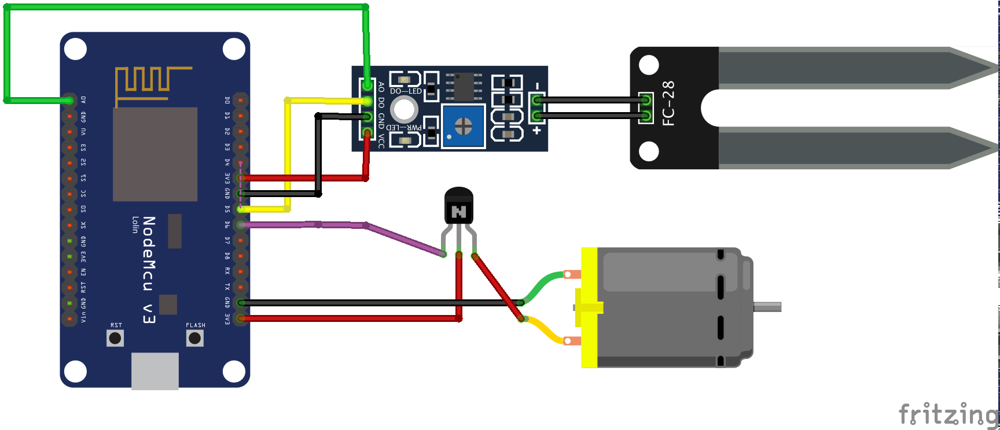

# Plant Tech

**🌱 Table of Contents 🌱**
- [Before the event](#before-the-event)
- [At the event](#at-the-event)
- [After the event](#after-the-event)
  - [NB! Giving feedback](#nb-giving-feedback)
- [Project extensions](#project-extensions)
- [Community Contributions](#community-contributions)
- [Useful resources](#useful-resources)

## Before the event
We're excited to have you join this course, where you'll be working with plants, Arduino boards, moisture sensors and watering systems. The aim of Make Days is to explore and learn new things. You don't need to achieve specific goals. The structure caters for varying levels of experience; different Makers will learn different things by playing with the same tools!

**👉 Before the event, complete the [Make Preparation Manual](https://github.com/OfferZen-Make/plant_tech_ams/blob/master/PREP.md) to get your LED blinking and ensure you are setup for the event.**

Please see [Troubleshooting](https://github.com/OfferZen-Make/plant_tech_ams/wiki) if you run into issues.

## At the event

### Bring your own

* Tall glass or container with water to test the sensor and water pump
* Laptop/PC with USB-A port or adaptor

### What will be available for you on the evening

**In the diagram**
1. ESP8266 module - [how it works](https://lastminuteengineers.com/esp8266-nodemcu-arduino-tutorial/)
2. Dupont f-f wires (x10)
3. Moisture sensor
4. Watering pump
5. TIP31C Transistor

**Additionally**
* Micro usb to usb A cable
* PVC tube + cable tie
* Connector

### Part 1 - Set up your plant 🌱

#### 🇳🇱 Netherlands Teams

Add 300 ml water to the bag with pressed soil, forming ~1 liter of compost. Make a few small (1cm deep) holes in the soil and place the basil seeds in them, covering with a bit of loose soil.

#### 🇿🇦 South African Teams
- Fill your pot most of the way with soil
- Sprinkle your seeds on top
- Cover with ±1 cm soil

### Part 2 - Moisture Sensor 💦

Connect the moisture sensor with the LM393 chip that comes in the same pack. The sensor has both an analog (0 for wet and 1023 for dry) and a digital (LOW for wet and HIGH for dry) output. Check the pinout for the sensor above and see where it would connect to the ESP8266 board (tip: it has an analog, digital, GND, and needs a voltage).

Connect the ESP8266 with your PC and start up the Arduino IDE. Sometimes the ESP8266 does not show in your IDE. If so, look for the right USB-port (Tools > Port).

Try writing a little programme to print the sensor's moisture values (analog is more interesting here as it gives you a value from a wetness-range). If coding isn't your strong suit, you can use the code provided in this repo for the [Moisture Sensor](https://github.com/OfferZen-Make/plant_tech_ams/blob/master/MoistureSensor.ino).

Upload your code to your system, wait untill the upload is done - the terminal should read: "Leaving... Hard resetting via RTS pin..." - and open the monitor (Tools > Serial Monitor) to see your printed values. Make sure that the Baud rate in the program and your serial monitor window are the same. If you used the code from the repo above, select the 115200 BAUD option for upload speed, otherwise your readings are not printed.

Put your sensor (only the two large exposed pads) in the compost of your plant, or simply put it in a glass of water, to do some readings!

### Part 3 - Mini Water Pump ⛽️

The pump is water submersible, sucks in water from the hole on the opposite end of the wires, and pumps it through the little outlet. In order to switch the pump on and off, it needs to be connected to the ESP8266 with the TIP31C Transistor. Use the connector (white block with four inlets) to do so. The two wires of the pump go in one side, the other side takes your Dupont wires. By gently pulling off the plastic bit of one side of the Dupont wire, exposing the metal, you can put it in the other side of the connector.

 

The pump has a GND output to be connected to the ESP8266 and receives power from the emitter pin of the transistor. The transistor gets its power through its collector pin from the ESP8266's 3V3 pin. Finally, connect the base to the D6 pin to be able to control the pump.

Write some code (or check the code from the [complete watering system](https://github.com/OfferZen-Make/plant_tech_ams/blob/master/plant_watering_system.ino) in this repo) to get the pump up and running. Before uploading the code, make sure to submerse the pump in your tall glass/container filled with water, as you do not want to overheat its motor - and please watch out for water spills ;)

### Part 4 - Time to play! 🥳

Now that the basics of your system are up and running, it's time to play around a bit! You can put your moisture sensor in your plant and attach the PVC tubing to the water pump (potentially use the cable tie to prevent leaking) with one end, and lay the other end in the plant.

See what analog value would be a good threshhold of dryness. Implement this in your code to start activating your pump as soon as this threshold is reached. Also try to implement some delays in your code to stop the pump after a few seconds, as it takes some time for the soil to get moist and the sensor to pick this up.

If you are confident that your very own automated watering system is fully working, you can check out the repos below for some inspiration on how to communicate with your system via your phone :)

## After the event

### NB! Giving feedback

After the event we only ask one further thing: please help us keep these going and growing by giving us feedback and inviting friends using the forms below 🙏
- [🇳🇱 Netherlands](https://forms.gle/NZ6FT3DuhXuW6MuG9)
- [🇿🇦 South Africa Feedback](https://docs.google.com/forms/d/e/1FAIpQLSc-JSOmKebYERO_tBQ18r8Ns89_u6GeP27yr6w9Vfl6dzV8sw/viewform)

🎁 We want to give you the gift of giving! please refer people that you think would love to attend one of our next sessions and get the Make @ Home Box delivered to their door. You can do so via the same form! 🎁 

## Project extensions

You can find extensions for the project here.

### Connect to the WiFi
Connect your ESP8266 with [your Wi-Fi](https://www.instructables.com/IoT-ESP8266-Series-1-Connect-to-WIFI-Router/)

### Build a chatbot
Let your system update you, and feed it commands, via text/slack/whatsapp with the [MessageBird API](https://github.com/mariuspot/plant_tech_ams/blob/master/webcontrol.ino)

Send messages on [slack or telegram](http://blog.danishjoshi.com/2019/11/06/sending-messages-to-a-slack-or-telegram-channel-using-esp8266/).

Telling your plant to water itself - by speech! [Blogpost + code](https://codeburst.io/home-automation-using-google-assistant-dialogflow-firebase-esp8266-wemos-part-1-800c4dc15ad9)

### Set up a web server

Example
https://randomnerdtutorials.com/esp8266-dht11dht22-temperature-and-humidity-web-server-with-arduino-ide/

Important: if you want to use the ESP8266 WEB Server in this example you will need to downloand the following two libraries. These libraries are not available in the library manager.

#### Installing the ESPAsyncWebServer library
The ESPAsyncWebServer library is not available to install in the Arduino IDE Library Manager. So, you need to install it manually.

Follow the next steps to install the ESPAsyncWebServer library:

https://github.com/me-no-dev/ESPAsyncWebServer/archive/master.zip

Unzip the .zip folder and you should get ESPAsyncWebServer-master folder
Rename your folder from ESPAsyncWebServer-master to ESPAsyncWebServer
Move the ESPAsyncWebServer folder to your Arduino IDE installation libraries folder

#### Installing the ESPAsync TCP Library
The ESPAsyncWebServer library requires the ESPAsyncTCP library to work. Follow the next steps to install that library:

https://github.com/me-no-dev/ESPAsyncTCP/archive/master.zip

Unzip the .zip folder and you should get ESPAsyncTCP-master folder
Rename your folder from ESPAsyncTCP-master to ESPAsyncTCP
Move the ESPAsyncTCP folder to your Arduino IDE installation libraries folder
Finally, re-open your Arduino IDE

### RGB LED
Extend you project with an [RGB LED](https://howtomechatronics.com/tutorials/arduino/how-to-use-a-rgb-led-with-arduino/) to indicate moisture levels with colors.

### 3D printed enclosure

## Community Contributions

You can find code and projects and advice submitted by the community here. Please submit your code for inclusion :)

### [Automatic pid water portion control](https://github.com/ikilledmypc/plantwaterer) by @ikilledmypc

This project uses 2 humidity levels one for the night/morning and one for the afternoon/midday. You can set your timezone-offset and humidity levels in the web interface. I'm in the process of testing it on a live plant though so I won't take any blame for drowned plants. It does have a watchdog timer for safety.

### [Playing withb Arduino setup](https://github.com/ronaldf2000/basihetplantje) by @ronaldf2000

First attempt playing with the arduino enviroment working with embedded c++

## Useful resources

### Micropython submitted by Michiel Erasmus

- Ditch the Arduino IDE.
- 😊 Micropython = Python 3.4. No need to recompile your code. Run your code by pressing F5 (in Thonny) to run.
- Runs on ESP8266, ESP32-platforms. Has a filesystem so you can copy files to it from Mac/Win/Linux. 
- Interfaces with a huuuuuuge number of sensors.
- CircuitPython is a fork of Micropython. Go check out Micropython.
- Lotsa tutorials online available, otherwise let me know if/how I can help (@MIchiel Erasmus on OfferZen Community Slack). 
- Use https://thonny.org as editor.

### Other
- [ ] Check out #project-adruino-plant on Slack
- [ ] Read our [Make Manifesto](https://docs.google.com/document/d/12OtTltO-ozhGd7OzDswgLoRMLtfd3_i8_Pxw1Dx551U/edit)
- [ ] [Arduino IDE for Visual Studio (Visual Micro) - Visual Studio Marketplace](https://marketplace.visualstudio.com/items?itemName=VisualMicro.ArduinoIDEforVisualStudio)
- [ ] [Node-RED](https://nodered.org/) - Node-RED is a programming tool for wiring together hardware devices, APIs and online services in new and interesting ways.

### Additional equipment

| Item      | Description |
| ----------- | ----------- |
| [I2C Soil Moisture Sensor](https://www.whiteboxes.ch/shop/i2c-soil-moisture-sensor/)      | add description...       |
| [Capacitive analog moisture sensor](https://s.click.aliexpress.com/e/_Ao5xVH)      | No metal parts touching the water so no corrosion problems causing inaccuracy in the long run       |
| [Linear Voltage Regulator](https://za.rs-online.com/web/p/linear-voltage-regulators/2988508/?cm_mmc=ZA-PLA-DS3A-_-google-_-PLA_ZA_EN_Semiconductors_Whoop-_-(ZA:Whoop!)+Linear+Voltage+Regulators-_-2988508&matchtype=&pla-302356913516&gclid=CjwKCAiAo5qABhBdEiwAOtGmbg7tuEvVQIAG1wTDop1IJoNiwtXcKgqFSBNvbamjBCqnsQrGesIdEBoCXyoQAvD_BwE&gclsrc=aw.ds)      | add description...       |
