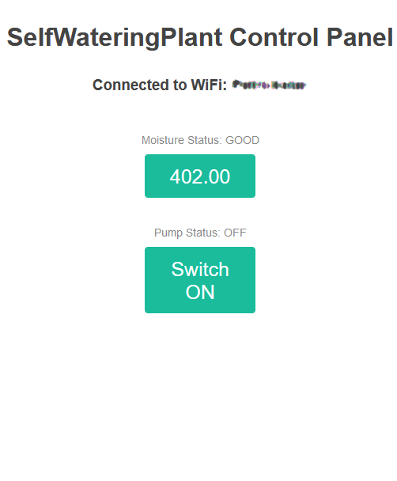

# MinimalWebServerUI

This is a minimal setup for the self-watering plant which includes a status web page. 

## First steps
After booting the ESP will try to connect to a WiFi hotspot. The credentials for that must be entered in the respective code section.
If it can't connect to your router after 10 attemps, it will create a hotspot.
The name of this network is `SelfWateringPlant_0001` and the password is `This_Is_Awesome`.
Connect your phone to that network and navigate your browser to the IP address `192.168.1.1`.

## The watering schedule
If the soil moisture falls below a defined threshold the program activates the pump for 2.5 seconds. 
It will then wait for 5 minutes until it will pump again.
This gives the soil time to absorb the new water and reach the sensor.
If it is still too dry the procedure repeats.

The values are kind of arbitrary and can be changed in the code.
The 2.5 seconds turned out good for me since it is enough to overcome height difference between the pump and the pot.

## The Web UI
This is very basic indeed. It is basically a status page which displays the sensor data.
It also lets you pump water manually, i.e. for testing the threshold.

