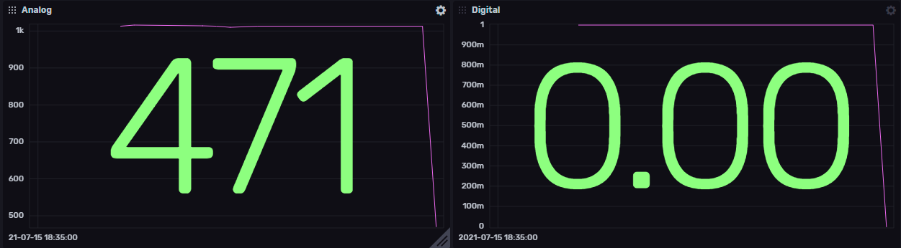

### InfluxDB

Sensor data and dashboard in the cloud.

 

Goto https://www.influxdata.com/ and create a new account for the Influx Cloud 2.0. At the rigth top "Login" -> "Login to InfluxDB Cloud 2.0" Then you will be redirected to a sign-up page. After sign-up you will get an activation e-mail, after activation you will be able to Login.

Once logged in the you can follow the instruction under "Data" for the Arduino Client Library.
