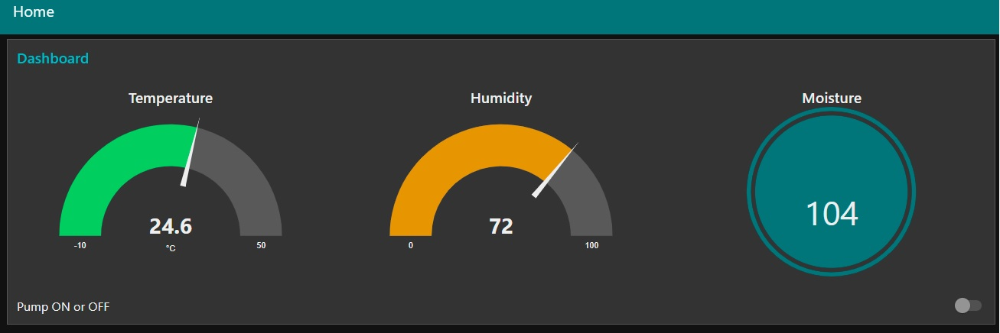

### Shopping list

* ESP8266
* Raspberry Pi
* DHT11 sensor
* 1-Relais 5V KY-019
* Capacitive Moisture Sensor

### Raspberry Pi as MQTT server

Installing a MQTT server on raspian. 
``` bash
sudo apt-get install mosquitto mosquitto-clients
```

### Enable the mosquitto broker

Enable the broker and allow it to auto-start after reboot using the following command:

``` bash
sudo systemctl enable mosquitto
```

The broker should now be running. You can confirm by checking the systemd service status:-

``` bash
sudo systemctl status mosquitto
```

```
● mosquitto.service - Mosquitto MQTT v3.1/v3.1.1 Broker
   Loaded: loaded (/lib/systemd/system/mosquitto.service; enabled; vendor preset: enabled)
   Active: active (running) since Wed 2021-07-07 20:59:34 CEST; 1 weeks 0 days ago
     Docs: man:mosquitto.conf(5)
           man:mosquitto(8)
 Main PID: 474 (mosquitto)
    Tasks: 1 (limit: 4915)
   CGroup: /system.slice/mosquitto.service
           └─474 /usr/sbin/mosquitto -c /etc/mosquitto/mosquitto.conf

Jul 07 20:59:33 mosquitto systemd[1]: Starting Mosquitto MQTT v3.1/v3.1.1 Broker...
Jul 07 20:59:34 mosquitto systemd[1]: Started Mosquitto MQTT v3.1/v3.1.1 Broker.
```

This is a simple MQTT broker and I did not password protect it, since it is inside my local network.

### MQTT topics
I defined the following topics:
* "dht/temp"
* "dht/hum"
* "moist"
* "pump"

Temp and hum for the temperature and humidity from the DHT11 sensor. Moist for the moisture value of the sensor. And pump for the status of the pump ON or OFF.

### The node-red dashboard

 

Default the dashboard is not part of node-red so you have to add it to node-red. So I had to install the dashboard inside node-red.

``` bash
node-red-stop
cd ~/.node-red
npm install node-red-dashboard
```

The node-red interface is running on:
```
http://pi-server:1880/
```

In the node-red you can import the flows.json. After deploying the flow the dashboard is running on:

```
http://pi-server:1880/ui
```

### Arduino Libraries

Installed the librarie from:
```
https://github.com/marvinroger/async-mqtt-client
```
for mqtt and 
```
https://github.com/me-no-dev/ESPAsyncTCP
```
where the async-mqtt-client depends on.

And from the managed libraries: DHT sensor library for espx for the DHT11 sensor.
