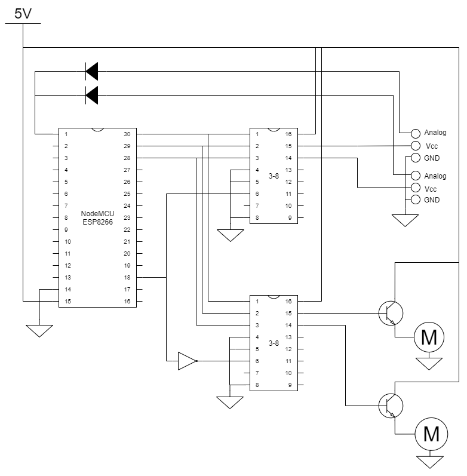

# Add multiple sensors and pumps to your make kit

## What you will need
1. Your Make kit with ESP8266 NodeMCU, sensor, pump and transistor
2. Additional sensors
3. Additional pumps (1 additional pump per additional sensor)
4. Additional transistors (1 transistor per pump)
5. Wires and connectors
6. 1x 3-8 BCD to binary converters [M74hc238 from Hobbytronics](https://www.hobbytronics.co.za/p/252/74hc238-3-to-8-line-decoder) [datasheet](https://www.alldatasheet.com/datasheet-pdf/pdf/23055/STMICROELECTRONICS/M74HC238.html)
7. 1x NAND gate [74HCT04E from Communica](https://www.communica.co.za/products/74hct04e) [datasheet](https://datasheet.datasheetarchive.com/originals/distributors/Datasheets-NXP/DSANXP010001037.pdf)
8. 1N4007 Diodes (1 per sensor) [From Hobbytronics](https://www.hobbytronics.co.za/p/389/1n4001-1n4004-1n4007-rl207-1n5404-1n5406-1n5408)


## How it works
The circuit works by converting the output from 3 digital output pins to binary through the 3-8 converter and using that to switch on each sensor or pump one by one. Readings are taken from the sensors one at a time through the analog pin. The NAND gate is used to determine if the sensors or the pumps must be switched on. In theory, this can be expanded to connect up to 24 sensors and pumps to one ESP8266 NodeMCU board:
* 3 digital pins are used to control 8 sensors and pumps,
* 1 digital pin is used to switch between sensors and pumps,
* The NodeMCU has 10 digital pins, i.e. 3 sets of 8 sensor/pump combinations can be controlled

## Technical details behind the components used
### How the 3-8 converters work
The 3-8 converters work by converting 3 digital values to 8 on or off (binary) signals.

<table>
  <tr>
    <td>Number</td>
    <td colspan="4">BCD</td>
    <td>Binary</td>
  </tr>
  <tr>
    <td></td>
    <td>8</td>
    <td>4</td>
    <td>2</td>
    <td>1</td>
    <td></td>
  </tr>
  <tr>
    <td>0</td>
    <td>0</td>
    <td>0</td>
    <td>0</td>
    <td>0</td>
    <td>00000000</td>
  </tr>
  <tr>
    <td>1</td>
    <td>0</td>
    <td>0</td>
    <td>0</td>
    <td>1</td>
    <td>00000010</td>
  </tr>
  <tr>
    <td>2</td>
    <td>0</td>
    <td>0</td>
    <td>1</td>
    <td>0</td>
    <td>00000100</td>
  </tr>
  <tr>
    <td>3</td>
    <td>0</td>
    <td>0</td>
    <td>1</td>
    <td>1</td>
    <td>00000100</td>
  </tr>
  <tr>
    <td>4</td>
    <td>0</td>
    <td>1</td>
    <td>0</td>
    <td>0</td>
    <td>00001000</td>
  </tr>
  <tr>
    <td>5</td>
    <td>0</td>
    <td>1</td>
    <td>0</td>
    <td>1</td>
    <td>00010000</td>
  </tr>
  <tr>
    <td>6</td>
    <td>0</td>
    <td>1</td>
    <td>1</td>
    <td>0</td>
    <td>00100000</td>
  </tr>
  <tr>
    <td>7</td>
    <td>0</td>
    <td>1</td>
    <td>1</td>
    <td>1</td>
    <td>01000000</td>
  </tr>
  <tr>
    <td>8</td>
    <td>1</td>
    <td>0</td>
    <td>0</td>
    <td>0</td>
    <td>10000000</td>
  </tr>
</table>

### NAND gates
NAND gates or Hex inverters are used to invert a given signal. For example a 1 becomes 0, and vice versa. 


### Why the diodes are important
The diodes are used to prevent the different sensors from influencing one another. 

## Circuit diagram


## Code
```C++
#define ANA A0
#define Out1 D0
#define Out2 D1
#define Out3 D2
#define SvP D10 //0 to turn on pumps, 1 to turn on sensors

double analogValue = 0.0;

void setup() {
  pinMode(ANA, INPUT);
  pinMode(Out1, OUTPUT);           
  pinMode(Out2, OUTPUT);
  pinMode(Out3, OUTPUT);
  pinMode(SvP, OUTPUT);

  Serial.begin(115200);
}


void loop() {
  //=======================================================================
  // Repeat this block of code for each plant but update the 
  // values passed to the readSensor function according to BCD numbers.
  delay(1000);
  Serial.println("Plant 1");
  readSensor(0, 0, 0); //Binary = 00000001 - check data sheet for component
  //=======================================================================
  
  delay(1000);
  Serial.println("Plant 2");
  readSensor(0, 0, 1); //Binary = 00000010

  delay(1000);
  Serial.println("Plant 3");
  readSensor(0, 1, 0); //Binary = 00000100

  delay(1000);
  Serial.println("Plant 4");
  readSensor(0, 1, 1); //Binary = 00001000

  delay(1000);
  Serial.println("Plant 5");
  readSensor(1, 0, 0); //Binary = 00010000

  delay(1000);
  Serial.println("Plant 6");
  readSensor(1, 0, 1); //Binary = 00100000

  delay(1000);
  Serial.println("Plant 7");
  readSensor(1, 1, 0); //Binary = 01000000

  delay(1000);
  Serial.println("Plant 8");
  readSensor(1, 1, 1); //Binary = 10000000
}


void readSensor(int out_1, int out_2, int out_3){
  digitalWrite(SvP, 1);
  digitalWrite(Out1, out_1);
  digitalWrite(Out2, out_2);
  digitalWrite(Out3, out_3);

  delay(100);
  analogValue = analogRead(ANA);
  Serial.println(analogValue);

  if(analogValue > 750){
    Serial.println("turning on pump");
    pumpOn(out1, out2, out3);
  }
}


void pumpOn(int out1, int out2, int out3){
  digitalWrite(Out1, out1);
  digitalWrite(Out2, out2);
  digitalWrite(Out3, out3);

  digitalWrite(SvP, 0); //switch on pump circuit
  delay(5000);
  digitalWrite(SvP, 1); //switch off pump circuit
}

```